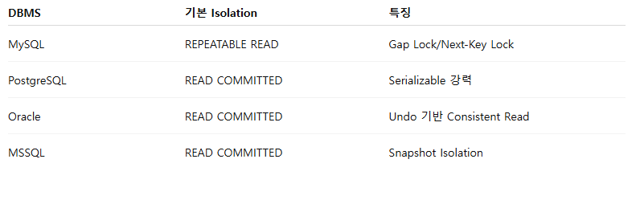

#  Spring  Boot에서 DB 동시성 제어와 비동기 처리 실험을 위한 프로젝트 
```
   안타깝지만 언어는 : JAVA 
   spring boot + MYSQL + JPA + QueryDsl 
   [swagger-ui] : http://localhost:7090/swagger-ui/index.html
   [Test] : JMeter 부하 테스트 
```

# 동시성 제어 예제를 염두해 둘 수 밖에 없는 이유 
```
  현재 회사에서 운영 중인 프로젝트인 linkschool에서 매번 일어 나고 있는 고질적인 이벤트 사항 때문에 예제를 만들어야 겠다 생각을 했다. 
  수업 시작/ 종료 같은 이벤트성 상태 변경은 네트워크 오류나 다중 요청 상황에서도 현실과 시스템 상태가 반드시 일치해야 하기 때문이다. 
  
  이건 단순한 퍼포먼스의 문제가 아니라. 
  서비스 신뢰성 (Reality vs DB Consistency)을 보장하는 핵심 요구 사항이다. 
  
  LinkSchool 프로젝트는 학교 시간표 관리 라는 도메인 특성상 수업 시작/종료 상태 전환의 정합성 보장 이 핵심이다. 
  수업이 끝나는 순간 네트워크 오류나 다중 요청으로 인해 현실과 시스템 상태가 불이치 하면, 선생님, 학생, 디바이스 화면이 엇갈리고
  서비스 신뢰도가 하락 합니다. 
  
  이를 해결 하기위해 다음과 같은 동시성 제어 예제를 위한 실험 예제 
 
```
  - 데이터 무결성 보장
    - Optimistic Lock, Pessimistic Lock을 활용해 동시성 제어
  - 상태 전환 유효성 확보
    - 서비스 레벨 에서 ONGOING 상태일 때만 ENDED로 전환 가능 
  - 실패 보상 처리 
    - 네트워크 오류 시 재시도 / 이벤트 큐 기반 비동기 처리
  - 분산 환경 대응
    - 여러 디바이스/트랜잭션에서 발생하는 요청을 안전하게 직렬화 


# 주요 기능
- 동시성 제어 (lab.lack)
  - 낙관적 락 (@Value)
    -  @Value 컬럼을 두고 Flush 시점에 값이 바뀌었는지 검증 ->  OptimisticLockException 발생시 재시도 로직 필요
    -  동시성 충돌이 드물거다라는 낙관적 가정 하에, DB에 실제 락을 걸지 않고, 트랜잭션이 자유롭게 데이터를 읽는다. 
    -  저장 할때 version 을 비교해서 변경 충돌이 났는지 확인 
    -  재시도 로직이 꼭 필요 하다. 
    -  ex.  재고 차감, 상태 전환
      ```
       [OptimisticLock] Stock id=1, version=2 → 변경 감지됨 → OptimisticLockException
      ```
    
  - 비관적 락(PERSSIMISTIC_WRITE , SELECT ... FOR UPDATE) 
    -  Querydsl  .setLockMode(LockModeType.PERSSIMISTIC_WRITE) -> SELECT ... FOR UPDATE 실행 -> 트랜잭션 종료 전까지 다른 UPDATE 차단
    -  ex. 은행 이체, 결제
      ```
      [PessimisticLock] SELECT ... FOR UPDATE 실행, stockId=1
      [PessimisticLock] Tx2 대기중... (Tx1 commit 이후 진행)
      ```
  - 트랜잭션 격리 수준 실험 (@Transactional)
  - 동시에 트랜잭션이 존재 할때, 한 트랜잭션이 무엇을 보게 되는가. 
  - 목적 :  읽기 일관성의 차이 이해 (이 트랜잭션은 어떤 시점의 데이터를 보나?)
  - 헥심 :  읽기 가시성, 트랙잭션 격리 수준은 동시성 문제를 해결 하기 위한 도구라기 보다, 동시성 상황에서 어떻게 보이는지릉 이해 하기 위한 개념이다. 
  - ex. 조회 정합성 실험 
    - [Mysql 기본 값] :  @Transactional(isolation = Isolation.READ_COMMITTED)
    - [동일 트랜잭션 내에서 값 일관성 보장] :  @Transactional(isolation = Isolation.REPEATABLE_READ)
    - [직렬 실행 처럼 동작] : @Transactional(isolation = Isolation.SERIALIZABLE)
    - [실무에서 거의 안 씀] : READ_UNCOMMITED  : DIRTY READ 
    
- 비동기 처리(lab.async)
  - @Async + @EventListener 기반 이벤트 처리
    - eventPublisher.publishEvent(new UpdateTask(...))
      @Async @EventListener 메서드에서 비동기 처리
      ```
      [EventPublisher] 이벤트 발행: stockId=1, qty=2
      [EventListener-AsyncThread-1] UPDATE 실행 → 재고 8
      ```
  - BlockingQueue 기반 Worker Thread 처리 (옵션)
  -  ex. 로그 처리 / 비 동기 적재 
    - BlockingQueue<UpdateTask> 에 적재 후 , 별도 Worker Thread 가 큐에서 꺼내  DB 반영
      ```
      [Queue] Task 제출: stockId=1, qty=2
      [Worker-1] Task 처리 시작
      [Worker-1] UPDATE 완료, 남은재고=8
      ```
- DB(lab.db)
  - MYSQL (로컬 개발 환경)
  - [위치] : lab.db.config
  - DB Lock : 최종 방어선 (데이터 무결성 보장)
  - JPA +  QueryDSL 기반 Repository 
    - JPAQueryFactory로 동적 쿼리  + 비관적 락 적용 
    ```
    [Querydsl] 실행된 SQL = select * from stock where id=1 for update
    ```

- Test(lab.test)
  - 멀티 스레드 환경에서 동시성 문제 (Lost Update) 재현 
  - [위치] : lab.test.concurrent
  - [원리] : ExecutorService + CountDownLatch → 동시 요청 발생 시 Lost Update 확인
    ```
    [Test] Tx1 SELECT → 재고=10
    [Test] Tx2 SELECT → 재고=10
    [Test] Tx1 UPDATE → 재고=8
    [Test] Tx2 UPDATE → 재고=8 (Lost Update 발생!)
    ```
  - 락 적용시 일관성 유지 검증 
  - [위치] : lab.test.locked
  - [원리] : 같은 시나리오에서 비관적 락 적용 -> Tx2가 Tx1 commit 이후 실행이 된다. 
    ```
    [Test] Tx1 SELECT FOR UPDATE → 재고=10
    [Test] Tx2 대기중 (lock held by Tx1)
    [Test] Tx1 UPDATE 완료 → 재고=8
    [Test] Tx2 SELECT FOR UPDATE → 재고=8
    [Test] Tx2 UPDATE → 재고=6
    ```
-  DBMS 추가 비교 표
  - 


```
 DB 기반 제어는 최종 방어선  (데이터 무결성 보장)
 서비스 기반 제어는 보조적 수단 (성능 / 비동기 처리 최적화)
 분산 환경이면 Redis / DB Lock Table 까지 고려해야 함 
 DBMS마다 동작 차이가 있으니, 내가 쓰는 DB 기준으로 테스트 필수 
```

### DB 락 확인 
- mysql 기준 
  -  SHOW PROCESSLIST;
### Transaction Isolation 확인 
- mysql 기준 
  - SELECT @@tx_isolation; 
  - REPEATABLE-READ 이상이면 FOR UPDATE 락 동작 정상 
### 화면 테스트를 위해 Vaadin 이라는걸 써봐야 겠다. 
- https://vaadin.com/docs/latest/components
- swagger로만 공유 되기 힘들때, 대략적인 포트 폴리오 용
- 단순 히 React / Vue 프로젝트 화면 설계 전까지만 도움이 된다. 


